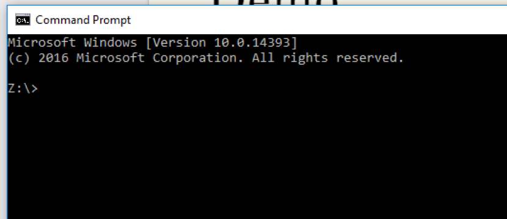
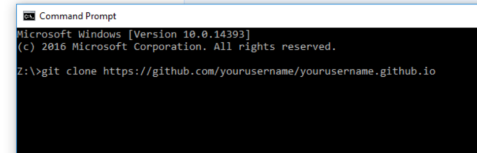
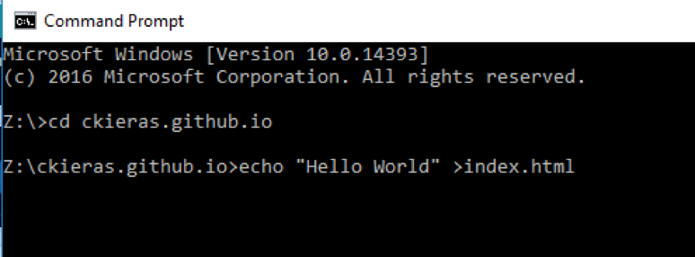
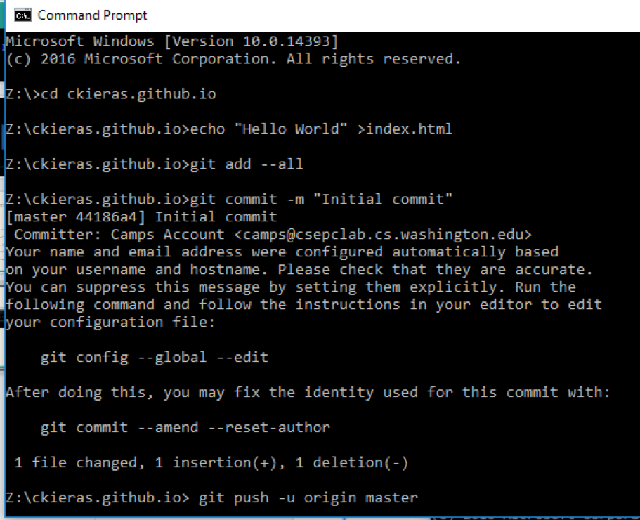
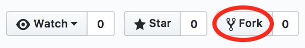
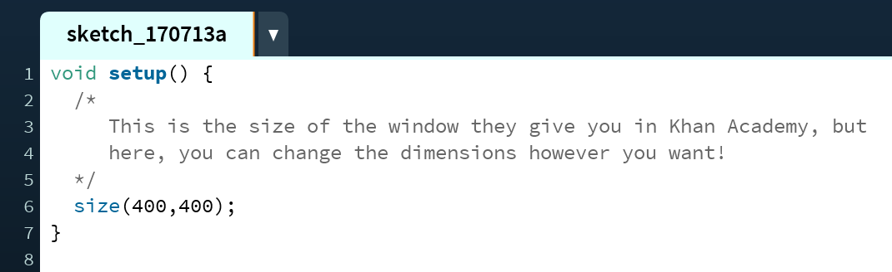
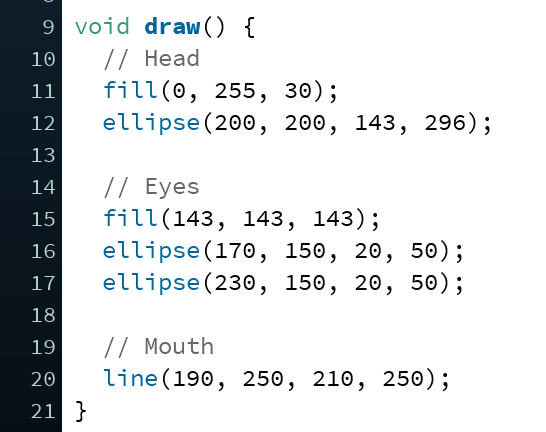

# How to Use GitHub Pages

### If you don't have a GitHub Account...
1. Go to GitHub.com and sign up
2. Click “Create a New Repository”
3. Name it yourusername.github.io (aka the username that you signed up with)
4. Search in the “Ask me Anything” bar “Command Prompt”
5. Make sure the Command Prompt is saving to the Z drive. (Z:\>)
6. Go to https://pages.github.com and scroll down to instruction #2 “Clone the repository”.
7. Copy the code there and paste it to the command prompt and continue copying the code from there.
8. Check on both GitHub and your computer to make sure you have a file called "index.html"

### Demo
##### Step 1:



##### Step 2:



##### Step 3:



##### Step 4:



#### Note: Keep Command Prompt open while we do this tutorial!

## Setting Up Your GitHub Repository

1. At the top right corner of this page, **fork** this repository.

  

2. On your computer, find the folder named **github-pages-demo** in the Z drive.  
3. Copy and paste the following files into the yourusername.github.io folder on your computer:


+ **index.html**
+ **processing.min.js**

  Go ahead and replace the original index.html file you had initially.
4. Finally, make a new folder called **sketches**. This is where you'll put all your Processing code.

## Converting Your Khan Academy Code to Processing.js

We're almost there! In order to host your code on GitHub Pages, you're going to have to make a few changes to your Khan Academy code.

1. Search in the “Ask me Anything” bar “Processing”
2. In a new sketch, add these lines:

  

3. Copy and paste your code from a Khan Academy project into the new sketch.
4. Any lines of code that draw something (lines, ellipses, etc.) into a ```void draw()``` function. It should look something like this:

  

5. If you have any variables that control an animation (i.e. ```var x = 20```, ```var speed = 5```), declare those at the **beginning** of your code, before ```void setup()``` and be sure to **specify their type** by replacing ```var``` with ```int``` for integers and ```float``` for decimals.
6. Any mouse or keyboard events might have to be changed as well. For example, ```mouseIsPressed``` will change to ```mousePressed```. Here's a link to the [Processing.js reference page](http://processingjs.org/reference/) to check for any other changes you'll have to make to your code.
7. Once you get your code working just the way you want, save the sketch into the **sketches** folder in yourusername.github.io.
8. Repeat these steps with any other projects you want to put on your website.

## Viewing Your Processing.js Projects on the Internet!

All that's left to do is to return to your ```index.html``` file and follow the instructions there to get your sketches so that they'll show up on the Internet. Then, input the following commands into Command Prompt to push all your changes up to your GitHub repository. It should look a little something like this:

**ADD SCREENSHOTS**
git status, git add . , git commit -m "added and edited files to host Processing on GitHub Pages", git push

Once you've finished that, you should be able to go to ```yourusername.github.io``` and see all your projects there!
